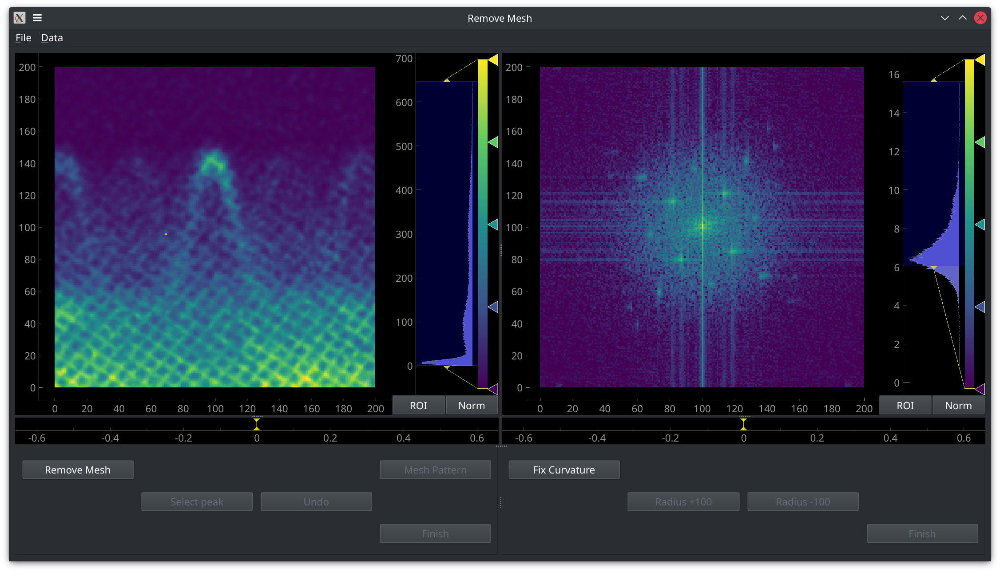
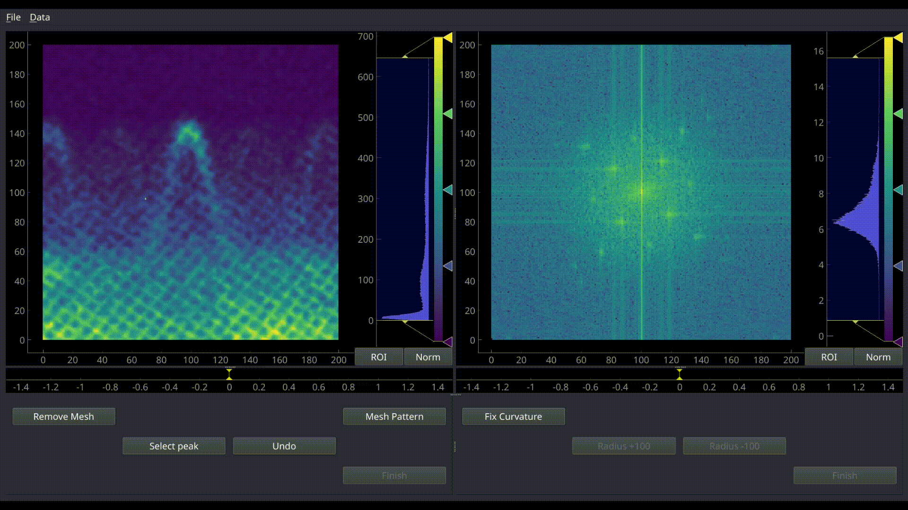

# RmMesh



## Requirements

Python 3 packages:

- qtpy
- A Qt binding, e.g. PyQt5, PyQt6, PySide2, PySide6
- pyqtgraph
- scipy
- numpy
- numba

## Usage

First, install [uv](https://docs.astral.sh/uv/getting-started/installation/) if you don't have it.

Then, clone this repository and create a virtual environment with the required packages:

```bash
uv sync --extra pyqt # or pyside
```

Finally, run the GUI:

```bash
uv run rmmesh
```

### Load Data

All ARPES scan images should be stored as a 3D matrix in a MATLAB data file. The matrix should be of the form data(column,row,index), where the index labels different images and (row,column) labels a certain pixel in that image.

Right-click the color bar to change the color mapping.

### Save Data

Use **File->Save...** menu to save data that is displayed in the left part at any time.

### Apply Fourier filter to images



Click **Remove Mesh** button to start this process. After selecting a peak in the left panel, click **Select peak** button to surpress this peak in Fourier space. You can reiterate this process to remove all visable peaks from Fourier space.

Use **Mesh Pattern** to finish this procedure and get a mesh template that can be applied to other scan images in the same beamline.

Use **Finish** to apply the mesh pattern to all the images.

### Advanced methods

After clicking **Mesh Pattern**, use **Data->Optimize mesh template** menu to improve the quality of the mesh pattern.
